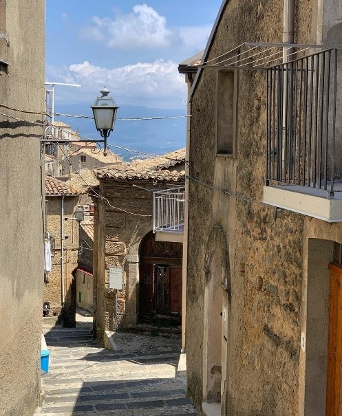
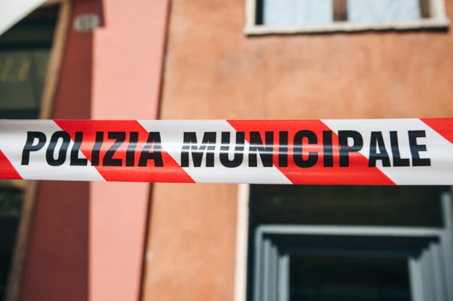

+++
title = "´Ndrangheta der Staat im Staat "
date = "2023-06-02"
draft = false
pinned = false
tags = ["Deutsch", "Reportage"]
image = "ein-zollbeamter-praesentiert.webp"
description = "Die ´Ndrangheta kontrolliert Kalabrien bereits seit Jahrhunderten. Der Staat hat die Gefahr, die die Mafia darstellt, zu spät wahrgenommen und die Mafia konnte sich so weit verbreiten, dass sie ganze Gebiete kontrolliert. Wie konnte es so weit kommen, dass sie eine ganze Region unter ihre Kontrolle bringen, ohne internationale Aufmerksamkeit zu erregen? Wie konnte sie so einen Einfluss etablieren, dass in Deutschland Morde begangen wurden im Namen der ´Ndrangheta? Und könnte es zu einer vollständigen Abhängigkeit Italiens kommen? M. S.* erzählt uns, wie sie die ‘Ndrangheta in ihrem Dorf wahrnimmt.  "
footnotes = "*\\*Name der Redaktion bekannt*"
+++
**Wie ist die Situation im Moment?** 

Ein kleines Dorf in Kalabrien. Es scheint friedlich auf den ersten Blick, jedoch wenn man etwas genauer hinschaut, merkt man, dass dieses Dorf unter einer Gewaltherrschaft steht. 

Zerstörte und unbewohnte Häuser, sich türmender Müll, offen sichtbare Armut und nicht fertiggestellte Brücken. Dies sind einige der vielen Folgen eines typischen, unter Mafia-Herrschaft stehenden Dorfes am Südzipfel Kalabriens. Die Herrschaft der Mafia sieht oftmals anders aus, als man es eventuell erwarten würde. Keine “Patrouillen” oder verschanzte Bewohner. Die normale Herrschaft über ein Dorf oder Gebiet ist eher eine sich auf einige Orte konzentrierte Feudalherrschaft. Zora Hauser, Mafia-Spezialistin an der Universität Oxford, beschreibt das System als ein Pächtersystem. In diesem System kontrolliert die Mafia das Gebiet meistens nicht durch direkte Kontrolle, sondern vielmehr durch ein Monopol in Infrastruktur und Jobs. So muss jemand, der auf Jobsuche ist, zwangsläufig mit der Mafia kooperieren, um einen Job zu kriegen. So bleibt die Region in der Regel arm, auch weil der Staat nur schwer in die bereits besetzten Gebiete vordringen kann. Diese Abhängigkeit der Bevölkerung verhindert auch, dass die Bevölkerung aktiv viel gegen die Mafia tun kann, da sonst wichtige Sektoren der Infrastruktur und der Jobmarkt teilweise oder sogar ganz kollabieren würden. Dies wirkt beinahe wie ein eigener Staat. Jedoch meint Zora Hauser, dass die Region zwar abhängig sein mag, aber die Mafia am Ende des Tages keine politischen Ambitionen hegt und vielmehr sogar selbst abhängig vom Staat ist. Der Staat trägt ebenfalls Teilverantwortung für die Armut und Schutzlosigkeit der Region vor der Mafia. Die Mafia präsentiert sich nämlich nicht wie ein autoritäres Regime, sondern eher wie eine Art Retter in der Not. “Sie sprechen nicht mit dir: “Du musst jetzt bezahlen, ansonsten werde ich deine Tochter erschiessen”, sondern sie kommen zu dir und sagen: “Wie kann ich dir helfen? Ich will dir helfen. Du hast ein Problem, ich helfe dir.” Natürlich ist nicht garantiert, dass das dann wahr ist. Also natürlich, wenn es zum Endpunkt kommt, wenn man nicht bezahlt, dann brennt im Zweifelsfall dein Laden. Es ist eine kriminelle Organisation. Aber wie sie sich darstellt, ist wie: “Der Staat kommt hier nicht her, er gibt dir nichts, er leistet nichts, ich kann dir etwas leisten. Ich schütze dich, weil der Staat dich nicht schützt. Ich gebe dir eine Arbeit, weil der Staat dir keine Arbeit gibt. Aber du musst loyal sein. ””  - Zora Hauser

Die Mafia erfüllt so viele Pflichten, die eigentlich dem Staat obliegen würden. Doch florieren können die Regionen nicht. Denn so viele Pflichten des Staates die Mafia auch erfüllen mag, sie kann und will den Staat nicht ersetzen. 

**Was ist die Mafia?** 

Die ‘Ndrangheta hat ihren Ursprung in Kalabrien. Sie gehört zu einer der gefährlichsten kriminellen Organisation der Welt. So mächtig werden konnte sie dank des Desinteresses der Justiz und der Bevölkerung. Denkt man an die Mafia, so kommt einem eher die sizilianische Mafia in den Sinn, die mehr in der Öffentlichkeit zur Sprache kam als die kalabrische Mafia, über die bis vor Kurzem noch ziemlich wenig bekannt war. Dass die ‘Ndrangheta sich so wenig bemerkbar macht, sieht man laut Gudrun Dietz an der Weise, wie unblutig und unspektakulär meist ihre Drogen- und Wirtschaftskriminalität ist, welche im Hintergrund geschieht. Dies macht die ‘Ndrangheta jedoch keinerlei ungefährlicher. Im Gegenteil ihre Verschwiegenheit und ihre Unsichtbarkeit in der Gesellschaft macht sie noch bedrohlicher und unschlagbarer. Ihre Unschlagbarkeit verdankt sie ihrem beinahe makellosem Aufbau. Tatsächlich gibt es in der ‘Ndrangheta kein oberstes Oberhaupt, ihr Aufbau ist nämlich horizontal. Es gibt Familien, die sich ein Territorium, also etwa Kalabrien, aufgeteilt haben. Über diese Territorien herrschen dann diese Familien. Eine Familie eines anderen Territoriums darf aber nicht zum Beispiel auf einem anderen Territorium ihre eigenen Geschäfte ausbauen. Mit Territorien sind kalabrische Städte gemeint. Das Besondere an der ‘Ndrangheta ist ihre Blutsverwandtschaft. Es gibt kein Mitglied der ‘Ndrangheta, das nicht blutsverwandt ist. Das bildet einen noch stärkeren Zusammenhalt der Mafia.  Es gibt in der Mafia eine absolute Pflicht zur Solidarität untereinander. Zudem ist die «Omertà» das höchste Gesetz der Mafia. Die Omertà ist die Schweigepflicht. Wer nicht schweigt, bekommt Schwierigkeiten. Das übliche Kommando über einen Clan (Familie) hat normalerweise der Mann. Muss er flüchten oder ist er im Gefängnis, so übernimmt die Frau das Kommando, das ist jedoch nur bei der ‘Ndrangheta so. Ansonsten hat die Frau in der Mafia die Rolle der «Sorella d’Omertà» (Schwester des Schweigens). Als solche verwalten sie Geschäfte ihrer Männer, bieten Flüchtigen einen Unterschlupf an und halten die Verbindung inhaftierter Oberhäupter und dem Clan auf.  

**Finanzen und Investitionen der ‘Ndrangheta**   

Die ´Ndrangheta ist europaweit eine der mächtigsten und reichsten Verbrecherorganisationen. Woher kommt jedoch dieser Reichtum? Die ´Ndrangheta ist Europas grösster Kokainimporteur. Sie besitzt Verbindungen zu südamerikanischen Kartellen und ist so praktisch unangefochten an der Spitze des Imports und Verkaufs von Kokain in Europa. 2004 wurde eine Schätzung der Guardia di Finanza abgegeben, laut jener die ’Ndrangheta ca. 22,34 Milliarden Euro allein mit dem Drogenhandel verdient haben soll. Dazu kommen weitere grosse Einnahmequellen wie die illegale Müllentsorgung, Waffenhandel und Prostitution, was zu einem geschätzten, jährlichen Umsatz von unglaublichen 50 Milliarden Euro führt. Es ist allerdings schwierig, Schätzungen abzugeben, da es keine Buchführung gibt und es daher sehr schwierig ist, den genauen Umsatz zu bestimmen. Nun stellt sich die grosse Frage, was die Mafia mit all diesem Geld macht. Die Antwort ist sowohl einfach als auch besorgniserregend. Sie investiert in weitere Immobilien oder Wirtschaftszweige. Das bedeutet, dass je mehr Einnahmen die Mafia hat, desto schneller und mehr wächst ihr Potenzial. In Italien hat die Mafia 2004 bereits 3,4 % des Bruttoinlandprodukts von ganz Italien ausgemacht.  Obwohl der Hauptgewinn vermutlich aus dem Drogenhandel stammt, sind auch andere Wirtschaftszweige interessant für die Mafia geworden. Namentlich die illegale Abfallentsorgung. Hier werden Regierungsaufträge von Unternehmen angenommen, welche die Mafia kontrolliert, und diese verschiffen den Abfall nach Kalabrien oder an andere Orte, wo sie anschliessend vergraben werden. Allein in der Region Gioia Tauros ist Müll aus ganz Europa auf einer Fläche von 60 Fussballfeldern vergraben. Auch Giftmüll und Abwasser werden nach Kalabrien verschifft, um dort entsorgt zu werden. 

Nun stellt sich die Frage, ob durch diese Aufträge Regionen «beinahe» abhängig werden könnten. Die international anerkannte Mafiaspezialistin Zora Hauser sagt, dass eine Abhängigkeit dort entstehen kann, wo die Mafia wichtige Aufgaben der Infrastruktur übernimmt. Die Mafia kontrolliert ebenfalls in den von ihnen kontrollierten Orten die Jobsuche, was die Bevölkerung vollkommen abhängig von ihr macht. Dies könnte ebenfalls ein Grund für die tendenzielle Verarmung der von der Mafia kontrollierten Gebiete darstellen. Durch diese Verarmung ist es oft auch nicht möglich, für Opfer der Mafia die Region zu verlassen.  

**Kann man die Mafia heutzutage überhaupt noch loswerden?** 

“Am besten wäre es, das Vertrauen der Bevölkerung gegenüber dem Staat wiederherzustellen und alle Handlungen der Mafia öffentlich zu machen.”, laut S. Mattioli, Mafiaspezialist. 

Es gibt mittlerweile viele Massnahmen, um gegen die Mafia vorzugehen, darunter neu eingeführte Gesetze in Italien, die es der Mafia erschweren sollte, ihren Geschäften nachzugehen, doch diese reichen offensichtlich nicht aus. Alle Handlungen der Mafia öffentlich bekannt zu machen ist sehr wichtig; die Tatsache, dass man nicht genau weiss, was die Mafia genau macht, verursacht gewaltiges Misstrauen in der Gesellschaft. “Früher waren die Leute sozialer. Heute sind sie falsch. Alle sind für sich, und man bekommt nichts ohne Gegenleistung. Man muss aufpassen, wovon man redet, denn alle wissen es.”, so M. S. Dadurch, dass die Bewohner Italiens nicht ohne Furcht und Misstrauen über gewisse Geschehen reden können, vereinfacht es der Mafia natürlich, über der Bevölkerung zu herrschen und so ihren Geschäften nachgehen zu können und vor allem unsichtbar zu bleiben. Das Misstrauen erscheint aber nicht nur unter der Bevölkerung, sondern auch von der Bevölkerung gegenüber dem italienischen Staat. Wenn man sich vor Augen führt, dass die Politik in Italien so korrupt ist, dass selbst der ehemalige Ministerpräsident Berlusconi in Geschäften mit der Cosa Nostra steckte, ist es klar, dass alles Vertrauen der Bevölkerung gegenüber dem Staat zunichtegemacht wurde. “Vor der Mafia habe ich keine Angst, aber davor, mich verteidigen zu müssen. Jemand zu verdächtigen ist gefährlich. Lässt du deine Türe offen, und jemand kommt und macht dir alles kaputt, bist du daran schuld und kannst nichts machen”, sagt M. S. Die Polizei macht nichts, um der Bevölkerung zu helfen, denn entweder ist sie machtlos, oder sie ist selber korrupt. Die Bevölkerung ist also auf sich alleine gestellt und noch schlimmer, misstraut sich selber. Ist es da also noch möglich, etwas gegen die Mafia zu tun? Wie erklärt, das Misstrauen wegzuschaffen ist fundamental. Darüber hinaus muss man unbedingt die Bevölkerung möglichst weltweit auf dieses Problem aufmerksam machen, denn wenn schon in Italien die Menschen sich daran gewöhnt haben, mit der Mafia zusammenleben zu müssen, sieht es in anderen Ländern kaum besser aus mit der Anti-Mafia Bekämpfung, namentlich Deutschland, die relativ stark von der Mafia in Angriff genommen wurden, nehmen das Problem kaum wahr. Die Duisburger-Morde beispielsweise sorgten nur kurz für Aufsehen und Aufschreie, dass es die Mafia ja tatsächlich gibt, aber wahrgenommen wurden die Morde nicht als wachsende Gefahr einer Übernahme durch die Mafia, sondern mehr als übliche Morde. «Um also einen Aufschrei der Gesellschaft erreichen zu können, benötigt diese die nötigen Informationen.»- Gudrun Dietz. Und das führt uns zu unserer erst genannten Methode für die Bekämpfung der Mafia: Alle Handlungen der Mafia öffentlich geben.  

**Fazit:**  

Die Mafia ist nicht primär deshalb gefährlich, weil sie immer wieder Opfer fordert oder weil sie der grösste Kokainimporteur Europas ist, sondern vor allem, da sie Regionen, die sie kontrolliert von ihr abhängig macht. Die Mafia, auch wenn sie wichtige Aufgaben erfüllt, ist nach wie vor eine kriminelle Organisation, die sehr schwer loszuwerden ist, da sie weltweit aktiv ist. Wir sind davon überzeugt, dass der beste Weg, die Mafia zu bekämpfen, die Aufklärung der Bevölkerung über die Taten der Mafia und die internationale Zusammenarbeit der Strafverfolgung sowie eine Verschärfung spezifischer Gesetze wäre. Bis dies jedoch erreicht ist, hat die Welt noch einen langen Weg vor sich.